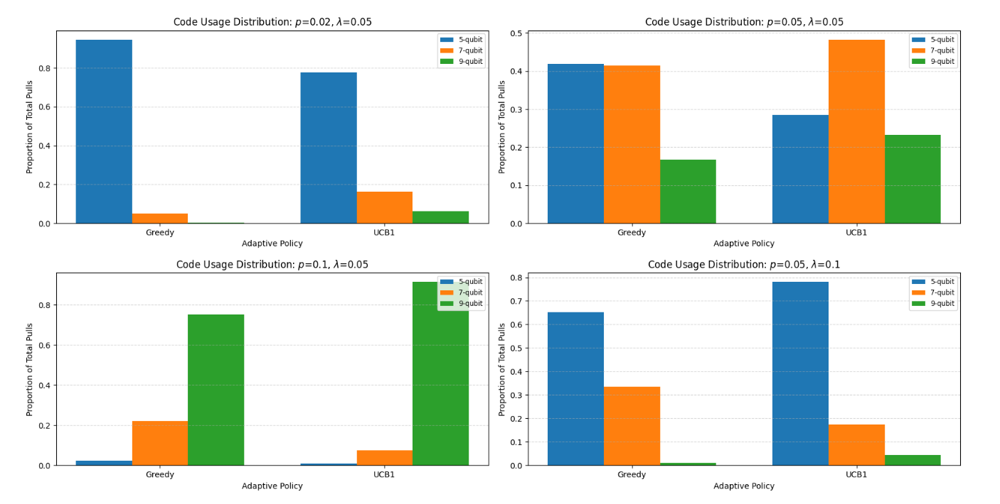

# Adaptive Quantum Error Correction

### EE7001 : Quantum Communications and Networking · IIT Bombay · Autumn 2025

### Under the guidance of Prof. Gaurav Kasbekar

  

This repository contains the work completed as part of the course **EE7001** at **IIT Bombay** during Autumn 2025.
The project was carried out by **Yaswanth R Kumar**, **Jithin K**, and **Krunal V**. It includes a study of fundamental Quantum Error Correction (QEC) codes and an online-learning–based adaptive QEC framework developed for the end-term project.

---

## Repository Contents

### Midterm Study: Foundations of QEC

A detailed study of 3-qubit bit-flip and phase-flip codes, along with the 9-qubit Shor code.
These files contain the analysis, circuits, syndrome logic, and fidelity discussions.

* **Midterm Report**:
  [midterm_report.pdf](./EE7001_midterm_report.pdf)

* **Midterm Presentation**:
  [midterm_presentation.pdf](./quantum_midterm_presentation.pdf)

---

## Endterm Project: Adaptive QEC via Online Learning

This part formulates QEC code selection as an online decision problem.
The core idea is to dynamically choose among QEC codes based on observed channel behaviour, using learning strategies inspired by multi-armed bandits.

Included materials:

* **Endterm Presentation**:
  [endterm_presentation.pdf](./quantum_endterm_presentation.pdf)

* **Implementation Files**
  Code implementing baseline QEC schemes and the adaptive algorithms:

  * `ada_qec.py`
  * `five_qec_full.py`
  * `3qub_code_bit_flip.py`
  * `qec_all.py`
  * `main.py`
  * `simulations_midterm.ipynb`

* **Simulation Outputs**

  * `qec_results.txt`
  * Also see the [endterm_presentation.pdf](./quantum_endterm_presentation.pdf)

---

## Project Summary

This project explores two layers of work:

### 1. Studying Classical QEC Codes

The team revisited well-known codes to build intuition for error detection, correction, and resource overhead.
The midterm presentation  and endterm slides  present the conceptual and mathematical foundations of these codes.

### 2. Designing a Dynamic QEC Strategy

The adaptive method:

* Learns the channel noise level online
* Balances fidelity against physical qubit cost
* Selects the most efficient code at each step
* Adjusts to non-stationary noise conditions using sliding windows

Simulations demonstrate that adaptive strategies outperform any fixed QEC code selection across different noise regimes, both in fidelity performance and in total physical qubit consumption.

---

## Team

* **Kollapudi Jithin**
* **Krunal Vaghela**
* **Yaswanth R Kumar**
